# claude-code-cred-guard

<p align="center">
  
</p>

A single-file, zero-dependency PreToolUse hook for [Claude Code](https://code.claude.com) that stops the agent from **reading credentials into its context** — credential files *and* bulk environment-variable dumps — without false-positives when those filenames are merely *mentioned* (search patterns, prose, notes, or invoking scripts that consume credentials machine-side).

```
cat .env                                   -> BLOCKED
python -c "print(open('.env').read())"     -> BLOCKED
grep pass "$HOME/.env"                     -> BLOCKED
bash -c "sed -n '1,20p' wp-config.php"     -> BLOCKED
git show mybranch:wp-config.php            -> BLOCKED
cat ~/.aws/credentials                     -> BLOCKED
printenv                                    -> BLOCKED (bulk env dump)
env | grep DB_PASSWORD                     -> BLOCKED (bulk env dump)
gci Env:                                    -> BLOCKED (PowerShell env drive)

grep -n "sftp.json|token" client.py        -> allowed (search pattern, not a read)
python tools/deploy.py prod file.php       -> allowed (script consumes creds machine-side)
cat >> NOTES.md <<'EOF' ... sftp.json ...  -> allowed (prose mention)
sed -n '/sftp.json/p' client.py            -> allowed (sed program arg, not a target)
git commit -m "harden wp-config.php"       -> allowed (commit message, not a read)
printenv PATH                              -> allowed (single named var, not a dump)
env NODE_ENV=prod node app.js              -> allowed (assignment prefix, runs a command)
```

## Why

When a coding agent runs `cat .env` or `Read`s `wp-config.php`, the plaintext secrets land in the conversation transcript — which is sent to the model provider and persisted in local session logs. The fix is behavioral (make the agent run scripts that consume credentials machine-side and print only non-secret metadata), but agents slip. A deterministic hook is the backstop.

The naive version of this hook — a substring or regex-anywhere test for `.env` in the command — is what most public implementations do, including the widely-copied docs example. In real use that design fails in both directions:

- **False positives.** A test that fires whenever `.env` appears anywhere in a command blocks legitimate work: grep *patterns* that contain the filename, notes that mention it, and invocations of the very scripts that exist to handle credentials safely. Each false block interrupts the agent and trains it (and you) to route around the guard.
- **False negatives.** Substring checks miss `python -c "open('.env')"`, backslash Windows paths, `bash -c` bodies, `.envrc`, command substitution, `git show <ref>:file`, and heredocs piped into interpreters.

This hook does **target-based matching** instead: it asks whether a credential file is the *target of a read*, not whether its name appears somewhere.

## Threat model (read this before adopting)

- In scope: **accidental self-inflicted reads** by a cooperative agent. This is the overwhelmingly common failure mode.
- Out of scope: **adversarial obfuscation** (base64 staging, variable-splitting, `xargs` indirection, prompt-injected exfiltration). A regex hook cannot win that game; sandboxing, permission modes, and egress controls are the right layer. Tools like [narthex](https://github.com/fitz2882/narthex) attack that problem instead (and deliberately allow plain `cat .env` — the two designs are complementary).
- **Fail-open by design**: a crash in the hook must never brick the agent's shell. Every error path exits 0 (allow). If you prefer fail-closed, change those `process.exit(0)` calls to `process.exit(2)`.

## Requirements

- Node.js 18+ (uses regex lookbehind; no npm dependencies).
- Claude Code with hooks enabled. Works on Linux, macOS, and Windows — the CI runs the suite on Ubuntu and Windows.

## Install

1. Copy `hooks/block-cred-file-access.js` somewhere stable (e.g. your Claude Code hooks directory).
2. Register it in `~/.claude/settings.json` (or a project `.claude/settings.json`) under `PreToolUse`, matching `Bash`, `Read`, and `Grep`. **Use the absolute path to the file** — `~` is not expanded inside a hook command, so a literal `~/...` makes Node fail (and a failed hook does not block, so the guard would silently never run).

macOS / Linux:

```json
{
  "hooks": {
    "PreToolUse": [
      {
        "matcher": "Bash|Read|Grep",
        "hooks": [
          { "type": "command", "command": "node \"$HOME/.claude/hooks/block-cred-file-access.js\"" }
        ]
      }
    ]
  }
}
```

Windows — use the literal absolute path (env-var expansion depends on which shell runs the hook, so a literal path is the safe choice):

```json
{
  "hooks": {
    "PreToolUse": [
      {
        "matcher": "Bash|Read|Grep",
        "hooks": [
          { "type": "command", "command": "node \"C:\\Users\\YOU\\.claude\\hooks\\block-cred-file-access.js\"" }
        ]
      }
    ]
  }
}
```

3. Restart Claude Code (or reload settings) — hook changes are picked up at session start.

## What a block looks like

The hook exits 2 and writes an explanation to stderr, which Claude Code feeds back to the model so it can self-correct:

```
BLOCKED by cred-file guard: this command would READ credentials into context, either a
credential/secret file (.env, wp-config.php, sftp.json, id_rsa, *.key/.pem, _secrets/*,
.credentials/*, .aws/credentials, .kube/config, and similar) or a bulk environment-variable dump
(printenv, bare env, gci env:). That would put plaintext secrets into the transcript, which is sent
to the model provider and persisted in session logs. Run a script that consumes the value
machine-side and prints only success/fail plus non-secret metadata instead, or read a single
non-secret variable by name. Merely MENTIONING these filenames (grep/search patterns, prose, notes)
is allowed and does not trigger this guard.
```

## Customizing

The credential filenames are defined in **two places** that must stay in sync (one drives Bash-command matching, the other the `Read`/`Grep` tools):

- `CRED_TOKEN` — the regex used to detect a credential name anywhere in a Bash command.
- `isCredPath()` — the basename/segment list used for the `Read` and `Grep` tool paths.

Edit **both** or the two paths diverge (a filename blocked in `cat` would still be readable via the `Read` tool). Defaults cover `.env`, `.envrc`, and `.env.<suffix>` (but not lookalikes like `.environment`), plus `wp-config.php`, `sftp.json`, `token.json`, `id_rsa`/`id_ed25519`/`id_ecdsa`, `.netrc`, `.git-credentials`, `.pgpass`, `*.pem/key/p12/pfx/ppk`, the `.aws/credentials`/`.aws/config`/`.kube/config`/`.docker/config.json` files, and the `_secrets`/`.credentials` directories. Candidates for other stacks: `.npmrc`, `.pypirc`.

Bulk environment-variable dumps are a separate matcher, `ENV_DUMP` — it blocks `printenv`, bare `env` (including `env -0`, `sudo env`, and the near-whole-environment `env -u NAME` / `env --unset NAME` forms), `export -p`, and the PowerShell env drive (`gci Env:`, `Get-ChildItem Env:`), while allowing single named reads (`printenv PATH`, `Env:Path`), the `env KEY=val cmd` prefix runner (with or without `-u`), and `env --help`. It is matched inside interpreter `-c`/`-Command` bodies too (`bash -c "printenv"`, `powershell -Command "gci Env:"`).

To recognize a new **read verb** (e.g. a house `showfile` alias — `cat`, `bat`/`batcat`, `less`, `Get-Content` etc. are already covered), add it to `DUMP_VERB`. The verb families (`DUMP_VERB`, `GREP_VERB`, `SCRIPT_VERB`, `GIT_DUMP`) each apply a different quote/operand policy — see below.

## How it works

Six mechanisms, each of which exists because a review round or a real firing proved it necessary:

1. **Quote masking before segmentation.** All quoted spans (escape-aware) are replaced by placeholders *before* the command is split into segments on `| ; & newline`. Without this, the pipe inside `grep -n "a|b" file` corrupts parsing.
2. **Windows normalization.** Every token/path test runs on backslash-to-slash normalized text, so `type ..\wp-config.php` and `C:\Users\me\.credentials\token.json` are caught. This also mangles regex escapes like `sftp\.json`, so those stop matching the token — correct, since they are search patterns.
3. **Verb families with different quote policies.**
   - *Dump verbs* (`cat bat batcat head tail less more nl xxd od strings type Get-Content gc`): any credential token in the segment blocks.
   - *Grep family* (`grep egrep fgrep rg findstr Select-String sls`): operands are parsed by position, the way grep itself reads them. The first positional operand is the **search pattern** and never counts as a target (so `rg sftp.json tools/` and `grep -rn "wp-config.php" src/` are searches, not reads); every subsequent operand, plus the value of a file option like `-f`/`-Path`, is a **file target** and blocks if it resolves to a credential path (`grep DB_PASS "wp-config.php"`, `grep -R pass _secrets`). A pattern supplied via `-e`/`--regexp` is skipped, and when one is present all positionals become targets.
   - *Script verbs* (`sed awk jq`) and *git dump* (`git show|diff|log|blame|cat-file|stash`, including forms with global options like `git -C repo diff`): quoted spans are dropped as program args / commit messages; only unquoted targets block. `sed -n '/sftp.json/p' file` and `git commit -m "…wp-config.php…"` are not reads; `sed -n '1,20p' wp-config.php` and `git show ref:wp-config.php` are.
4. **Interpreter bodies.** `-c`/`-e`/`-Command` string bodies of `python node bash sh zsh pwsh powershell`, heredocs piped into interpreters, and here-strings (`bash <<< '…'`) get their own scan for read primitives (`open( readFile read_text ReadAllText readlines slurp …`) plus per-line verb checks. Heredocs fed to *non*-interpreters (e.g. `cat >> NOTES.md <<EOF`) are treated as prose.
5. **Chain and continuation handling.** `\`-newline continuations are joined; segments split on single `&` as well as `&& ; |`; `$(cat .env)` matches via the widened verb prefix. The interpreter-body scan is gated behind a cheap `-c`/`-e`/`-Command` presence test and its gap is length-bounded, so a long pasted command cannot cause catastrophic regex backtracking.

6. **Bulk environment-variable dumps.** These carry no filename for the mechanisms above to key on, so a dedicated matcher runs before the credential-token gate, on quote-masked segments (so a quoted mention like `echo "run printenv"` is inert) and inside interpreter `-c`/`-Command` bodies. It is scoped to whole-environment dumps only — single named-variable reads and the `env KEY=val cmd` prefix runner stay allowed — so its false-positive surface matches the rest of the tool. Flag-only invocations count as dumps, including the near-whole-environment `env -u NAME` / `env --unset NAME` forms; `env -u NAME cmd` still runs.

It also covers the `Read` and `Grep` tools directly (path-segment checks), so a `Grep` with `path: .../_secrets` blocks while grep *patterns* never can by construction.

## What it deliberately does NOT do

- No write/edit-side secret scanning (a secret *value* pasted into a file). That is a different, complementary hook — see gitleaks-based pre-commit/pre-push gates.
- No exfiltration-shape detection (read + network in one pipeline). See [narthex](https://github.com/fitz2882/narthex).
- No default-deny for unknown verbs: `cp .env /tmp`, `perl -ne` on a cred file, or `dd if=…` pass. [claude-code-sentinel](https://github.com/gltorres/claude-code-sentinel) closes that with a full bash tokenizer and an unknown-command-touching-secret rule, at the cost of ask-prompts on more command shapes. For the accidental threat model this hook chose precision; run both if you want breadth.

Known accepted residuals, all rare: `sed`/`awk`/`jq` with a **quoted** credential path as the target false-allows (the quoted argument is treated as the program/filter, not a file); and unknown read verbs (`cp .env /tmp`, `perl -ne … cred`, `dd if=…`) pass, since the guard keys off a known verb set rather than default-denying everything.

## How this compares to the field

Surveyed July 2026 by reading implementations, not READMEs (upstream code changes, so treat this as a snapshot). The dominant public pattern — including [claude-code-hooks-mastery](https://github.com/disler/claude-code-hooks-mastery) and the canonical docs example most repos copy — is a substring/regex-anywhere test over the raw command or the declared file path: it blocks prose and search patterns, misses interpreter bodies and Windows paths, and covers only `.env`. Several "security guardrail" kits protect only against *writing/committing* secrets and leave `cat .env` open. The two more serious efforts take different corners: [claude-code-sentinel](https://github.com/gltorres/claude-code-sentinel) has a real bash tokenizer and path policy (broad, but no interpreter-body scan and more ask-prompts), and [narthex](https://github.com/fitz2882/narthex) blocks exfiltration *shapes* while allowing plain reads by design. This hook's niche is the combination none of them target: read-side precision, mention-tolerance, interpreter-body coverage, and Windows path handling.

## Test

```
node test/matrix.test.js
```

127 cases (79 block / 47 allow / 1 performance), each one either a reproduction of a real false positive or an evasion found during review. The harness fails on any non-0/non-2 exit, spawn error, or timeout — a broken hook cannot pass silently. The performance case pushes a ~180 KB command through the hook and asserts it completes well under the timeout (no catastrophic backtracking). Run it after **any** edit to the hook; every mechanism above exists because its absence was reachable, and regressions are silent by nature.

## Uninstall

Remove the hook entry from your `settings.json` `PreToolUse` array and restart Claude Code. Delete the copied `.js` file if you like. There is no other state.

## Provenance

The design was shaped by classifying real firings of a naive predecessor (which surfaced that most firings were false positives on mentions), then hardened through several rounds of adversarial review by a second model acting as a red-team reviewer. Those numbers come from the author's own deployment and are not independently reproducible from this repo — treat them as the motivation for the design, not a benchmark. What *is* reproducible is the test matrix: every claimed behavior above has a corresponding case in `test/matrix.test.js`.

## License

MIT
